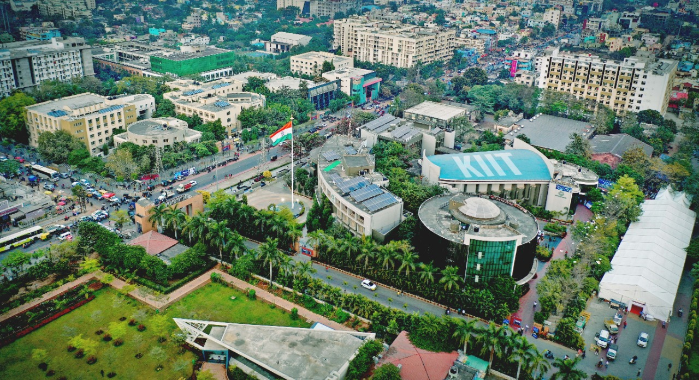
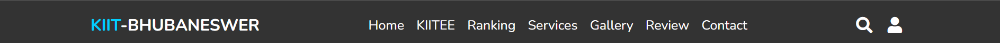
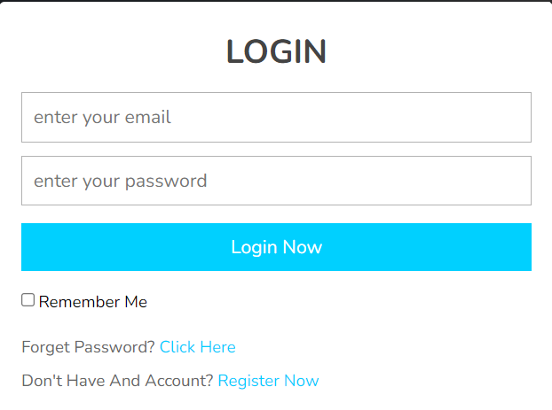
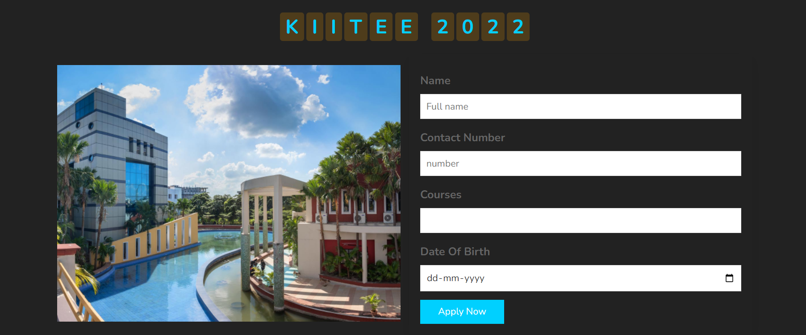
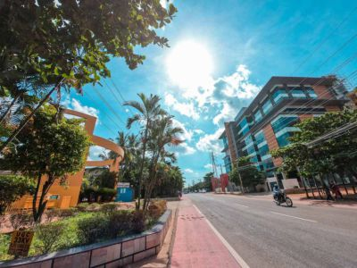
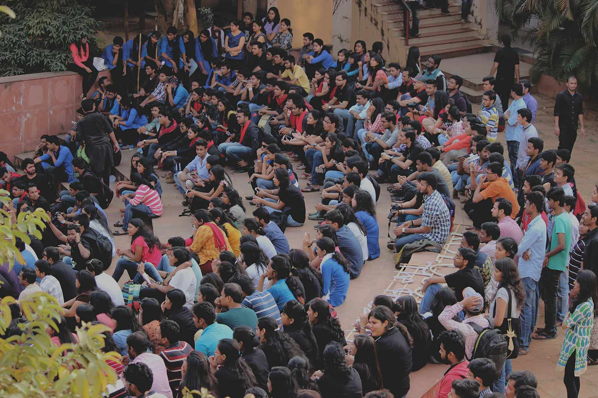
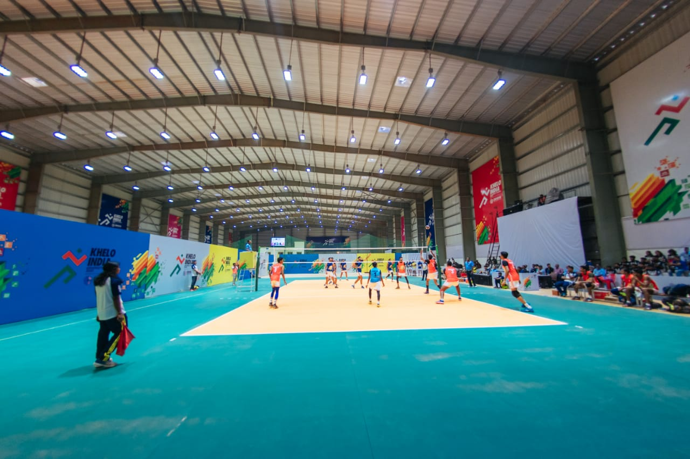
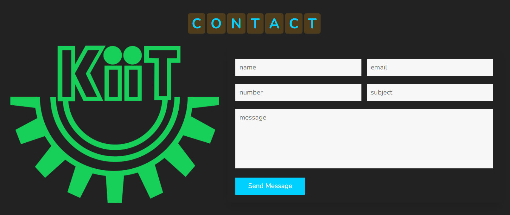

# KIIT Website

### A website dedicated to KIIT University
 

### This is a basic static website made with HTML, CSS and JavaScript

 

## Navbar 

<li>Users can easily and directly get navigated and know more about our university.
</li>

## Login page
 

<li>
A static login page.
</li>
<li>
Here Users can login and check their current status and data to ensure their needs towards university.
</li>

<li> Currently login page is not connected with our backend architecture.
</li>

 

### Apply for our university

- Here users can apply and fill form who are interested to take admission at our university.

<h1 align="center" >Section</h1>

 Gallery 

 
<li>
In this Section Users can, explore and learn more about college environment at our university.
</li>

 

## Contact page

<li>
Users can feel free to contact our Support Service.
</li>

 

## Contributers
<ul>
<li>Aditya Kumar</li>
<li>Smriti Chandra</li>
<li>Syed Junaid Ahmed</li>
<li>Ankit Maurya</li>
<li>Chandramauli kashyap</li>
</ul>